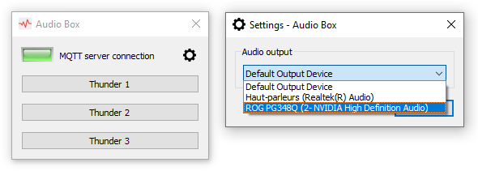

# AudioBox
*<a href="https://www.learnpyqt.com/" target="_blank">PyQt5</a> applet to launch audio effects without latency, can be used as a plugin for <a href="https://xcape.io/" target="_blank">xcape.io</a> Room.*

In the area of Escape Room, we need to kick audio effects that play immediately to ensure the best user experience.

For example, the players complete an escape game challenge and the system must play a winning sound *immediately*.

To realize this, here's the magic:
* preload the audio files
* audio files must be uncompressed in **`WAV` format**
* manage audio output devices (particularly on Windows Updates)



This standalone PyQt5 applet can be used as a plugin for *<a href="https://xcape.io/" target="_blank">xcape.io</a> __Room__* software.

> While Audio Box has been developped for Windows 10, it can run on a Raspberry Pi.

 
## Installation

1. First install Python 3.8.x in `C:\Python38` ([Windows x86-64 executable installer](https://www.python.org/ftp/python/3.8.2/python-3.8.2-amd64.exe) from <a href="https://www.python.org/downloads/release/python-382/" target="_blank">python.org</a>)

2. Download the code from this GitHub repository as a <a href="https://github.com/xcape-io/AudioBox/archive/master.zip" target="_blank">ZIP file</a>

3. Unflate it in your plugin folder

4. Run `install.bat` with a double-click to create the Python virtual environment (*venv*).

5. Set MQTT broker IP address in `constants.py`

    ```python
    MQTT_DEFAULT_HOST = 'localhost'  # replace localhost with your broker IP address
    ```

6. Run `run.bat` to launch AudioBox.


## Configuration
<a href="https://www.jetbrains.com/pycharm/download/" target="_blank">Pycharm Community</a> is the free python IDE recommended for hacking the vanilla AudioBox applet.

1. Copy your audio files in `./audio` folder (use `aconv.bat` to convert files to `WAV` audio)

2. Edit `definitions.ini` to set `mqtt-sub-effects` MQTT topic (the applet inbox to receive effect launch commands)

3. Edit `constants.py` to fill `AUDIO_EFFECTS` dictionnary

* More constants:
    ```python
    ALWAYS_ON_TOP =  True  # the audio box is always on top of other windows
    HIDE_APPLET = True     # the audio box is invisible (recommended when used as a plugin)
    UNSTOPPABLE =  True    # the user can't close the audio box window
    ```


## Author

**Faure Systems** (Jul 8th, 2020)
* company: FAURE SYSTEMS SAS
* mail: *dev at faure dot systems*
* github: <a href="https://github.com/fauresystems?tab=repositories" target="_blank">fauresystems</a>
* web: <a href="https://faure.systems/" target="_blank">Faure Systems</a>